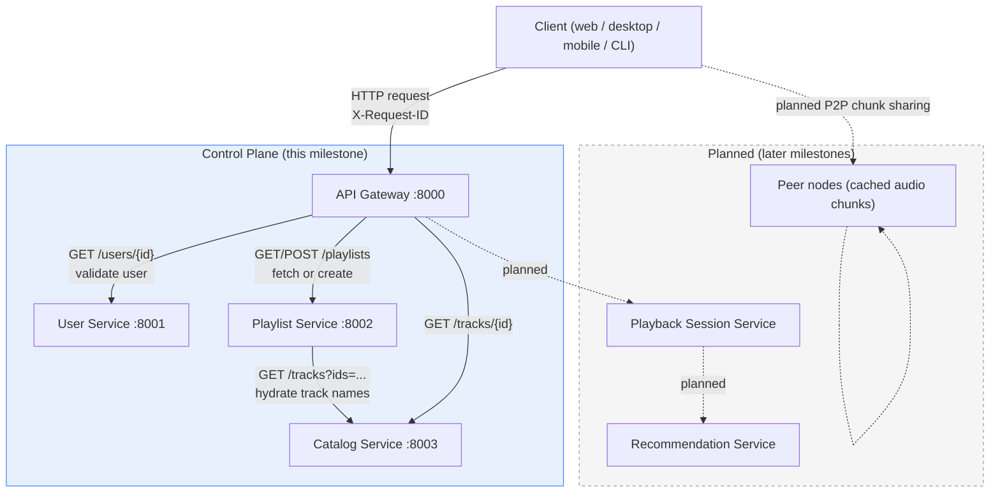
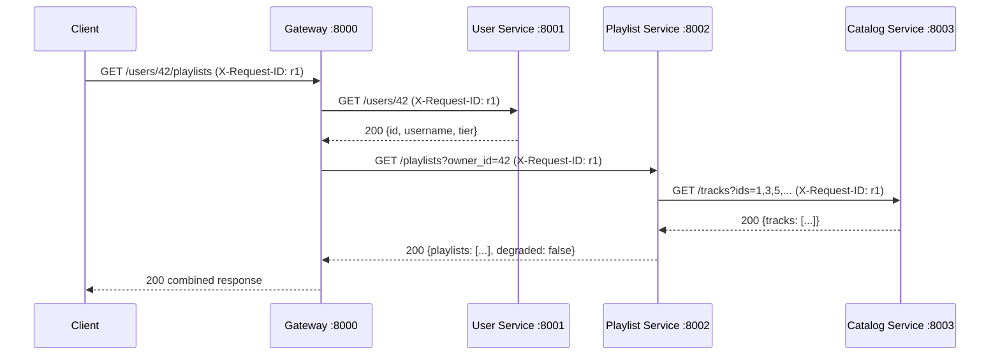

# Architecture

## Full system design

The target system is a hybrid architecture: a logically centralized control
plane (gateway, user, catalog, playlist, playback, recommendation services)
that is physically distributed across independent services, plus a
decentralized P2P layer for audio content distribution.

## Milestone 1 request flow

The centerpiece demo is `GET /users/42/playlists`, which fans out across
all three backend services under a single correlation ID:

Every hop logs a JSON line tagged with `request_id=r1`, so
`scripts/trace.py r1` reconstructs this exact sequence from the log files.

## Components (Milestone 1)

| Service | Responsibility | Depends on |
|---|---|---|
| API Gateway | Single client entry point; request ID assignment; routing; logging | User, Playlist, Catalog |
| User Service | Account lookup (id, username, subscription tier) | none |
| Playlist Service | Owns playlists; hydrates track metadata | Catalog |
| Catalog Service | Track metadata | none |

## System-model assumptions

- **Organization:** hybrid — the control plane above is logically
  centralized but physically distributed; a P2P content layer is planned
  for a later milestone.
- **Timing:** semi-synchronous. Client-to-service and service-to-service
  calls are synchronous request/response with bounded timeouts (2s) used
  for failure detection.
- **Node failures:** crash-stop / crash-recovery. No Byzantine failures.
  Each service owns its own in-memory (later: persistent) store.
- **Link failures:** messages can be lost, delayed, duplicated, or
  reordered. Handled with timeouts and limited retries on idempotent (GET)
  requests only.
- **Storage:** each service owns its own store; no shared database. Audio
  files (planned) are immutable; playlists and sessions are mutable shared
  resources, which is why they are the target for later coordination and
  replication milestones.

## Planned services (future milestones)

- **Playback Session Service** — tracks the current track/position per
  user and enforces "one active device per account."
- **Recommendation Service** — consumes play events asynchronously;
  degrades gracefully if unavailable.
- **Content / Peer layer** — audio chunks served from storage nodes, with
  clients acting as peers that cache and share chunks (P2P integration).
